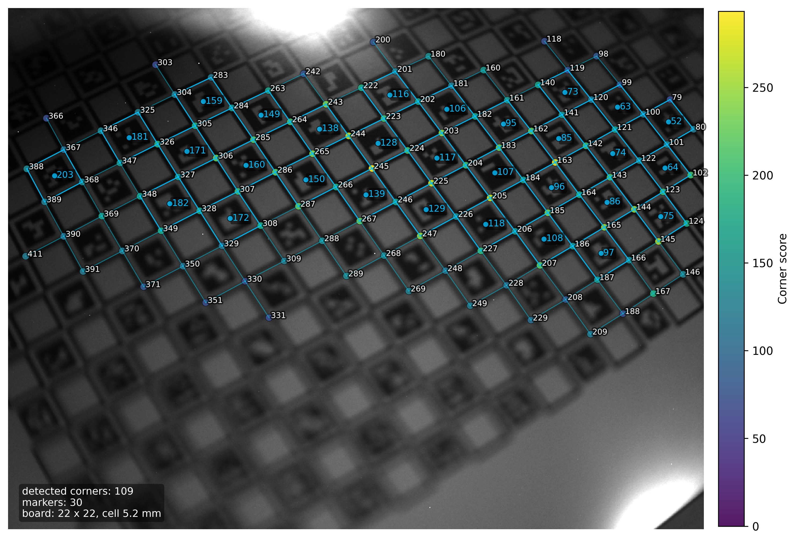

# calib-targets-rs

Calibration target detection in Rust (chessboard, ChArUco, ArUco/AprilTag, marker boards).



> **Status:** Feature-complete, APIs may change.

## Introduction

Target detection is built on top of the [ChESS corners](https://github.com/VitalyVorobyev/chess-corners-rs) detector. All target types share the same chessboard-style pipeline: build a graph over ChESS features and select connected components. The local nature of the algorithm makes it robust to lens distortion. Detection of calibration target features (ArUco markers or circles) uses a local projective warp, which avoids heavy pattern matching while remaining robust and fast. Each algorithms has parameters, but default setup should work in most of practical cases.

## Quickstart

### Chessboard

```bash
cargo add calib-targets image
```

```rust,no_run
use calib_targets::detect;
use calib_targets::ChessboardParams;
use image::ImageReader;

fn main() -> Result<(), Box<dyn std::error::Error>> {
    let img = ImageReader::open("board.png")?.decode()?.to_luma8();
    let chess_cfg = detect::default_chess_config();
    let params = ChessboardParams::default();

    let result = detect::detect_chessboard(&img, &chess_cfg, params);
    println!("detected: {}", result.is_some());
    Ok(())
}
```

This code (see [example](./crates/calib-targets/examples/detect_chessboard.rs)) was used to process the 1024x576 image shown below. End-to-end detection took 3.1 ms: 2.9 ms for ChESS corner detection (single scale, `rayon` feature on) and 132 µs for chessboard recognition. (Performance numbers here and later are from a MacBook Pro M4.)


The exact command used was:

```zsh
cargo run --release --features "tracing" --example detect_chessboard -- testdata/mid.png
```

### Markerboard

[This example](./crates/calib-targets/examples/detect_markerboard.rs) with the command

```zsh
cargo run --release --features "tracing" --example detect_markerboard -- testdata/markerboard_crop.png
```

produces the detection below (643x358 px):


in 2.4 ms (including 1.5 ms for ChESS corner detection and 250 µs for chessboard detection).

### ChArUco

The 720x540 px ChArUco target in the first image took 3.2 ms (2.1 ms for ChESS corner detection and 250 µs for chessboard detection).
ChArUco dictionaries and board layouts are fully compatible with OpenCV's aruco/charuco implementation.

[This example](crates/calib-targets/examples/detect_charuco.rs) shows the code. The command is:

```zsh
cargo run --release --features "tracing" --example detect_charuco -- testdata/small2.png
```

### The `TargetDetection` struct

`TargetDetection` is the common output container used by all detectors (returned directly for chessboards and embedded in result structs for ChArUco and marker boards). It describes one detected board instance:

- `kind` identifies the target type (`Chessboard`, `Charuco`, or `CheckerboardMarker`).
- `corners` is a list of `LabeledCorner` values. Each corner includes pixel `position`, optional integer `grid` coordinates `(i, j)`, optional logical `id`, optional `target_position` in board units (often millimeters), and a detector-specific `score` (higher is better).

Typical field usage:
- Chessboard: `grid` is set; `id` and `target_position` are `None`. Corners are ordered by grid row then column.
- ChArUco: `id` is the ChArUco corner id; `grid` and `target_position` are set when a board spec is available. Corners are ordered by `id`.
- Marker board: `grid` is set; `id` and `target_position` are populated when alignment succeeds and the layout has a valid cell size. Corners are ordered by grid coordinates.

## Crates

- [`calib-targets`](https://crates.io/crates/calib-targets) – facade crate with end-to-end helpers.
- [`calib-targets-core`](https://crates.io/crates/calib-targets-core) – core geometry and types.
- [`calib-targets-chessboard`](https://crates.io/crates/calib-targets-chessboard) – chessboard detector.
- [`calib-targets-aruco`](https://crates.io/crates/calib-targets-aruco) – ArUco/AprilTag dictionaries and decoding.
- [`calib-targets-charuco`](https://crates.io/crates/calib-targets-charuco) – ChArUco alignment and IDs.
- [`calib-targets-marker`](https://crates.io/crates/calib-targets-marker) – checkerboard + 3-circle marker boards.

(All crates are published on crates.io)

## Examples

The examples mentioned above are:

```bash
cargo run --example detect_chessboard -- path/to/image.png
cargo run --example detect_charuco -- path/to/image.png
cargo run --example detect_markerboard -- path/to/image.png
```

Examples with complete parameters control via json files are:

```bash
cargo run --example chessboard -- testdata/chessboard_config.json
cargo run --example charuco_detect -- testdata/charuco_detect_config.json
cargo run --example chessboard -- testdata/chessboard_config.json
```

The later produce detailed json reports that can be rendered by python scripts [plot_chessboard_overlay](tools/plot_chessboard_overlay.py), [plot_charuco_overlay](tools/plot_charuco_overlay.py), and [plot_marker_overlay](tools/plot_marker_overlay.py).

## Python bindings

Python bindings live in `crates/calib-targets-py` and are built with `maturin`.
See `python/README.md` for setup details.

Quickstart:

```bash
pip install maturin
maturin develop
python python/examples/detect_chessboard.py path/to/image.png
```

API surface:

- `calib_targets.detect_chessboard(image, *, chess_cfg=None, params=None)`
- `calib_targets.detect_charuco(image, *, board, chess_cfg=None, params=None)`
- `calib_targets.detect_marker_board(image, *, chess_cfg=None, params=None)`

Note: `target_position` is populated only when a board layout includes a valid
cell size and alignment succeeds (for marker boards, set
`params["layout"]["cell_size"]`).

Config inputs:

- `chess_cfg` accepts `None`, a dict of overrides, or a `ChessConfig` instance.
- `params` accepts `None`, a dict of overrides, or the typed params classes
  (`ChessboardParams`, `CharucoDetectorParams`, `MarkerBoardParams`).

## Performance and accuracy

Benchmarks are coming. The goal is to be the fastest detector in this class while maintaining high sensitivity and accuracy.

## Development

```bash
cargo fmt --all
cargo clippy --workspace --all-targets --all-features
cargo test --workspace --all-features
cargo doc --workspace --all-features
mdbook build book
```

For contribution rules see [AGENTS.ms](./AGENTS.ms).

## License

This project is dual-licensed under MIT or Apache-2.0, at your option. See `LICENSE` and `LICENSE-APACHE`.
