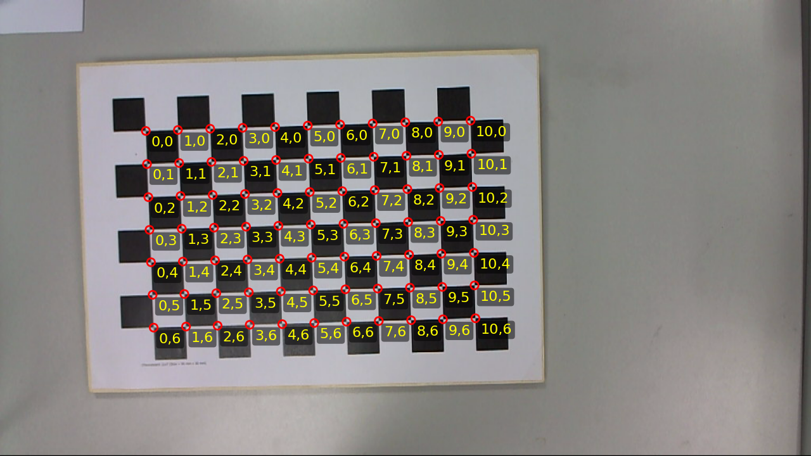

# calib-targets-rs

Early-stage calibration target detection library for Rust.



> **Status:** experimental & work in progress. APIs are not stable yet.

This repository contains a small family of crates for detecting various calibration targets from corner detections (e.g., ChESS corners). The focus is on clean geometry and target modeling; image I/O and corner detection are intentionally kept out of scope.

## Crates

- `calib-targets-core` – core geometric types and utilities:
  - `Corner`, `LabeledCorner`, `TargetDetection`, `TargetKind`
  - helpers such as `estimate_grid_axes_from_orientations`
- `calib-targets-chessboard` – plain chessboard detector built on top of `calib-targets-core`.
- `calib-targets-aruco` – embedded ArUco/AprilTag dictionaries and decoding on rectified grids.
- `calib-targets-charuco` – rectification utilities (global homography + mesh warp); ChArUco board solver is not implemented yet.
- `calib-targets-marker` – checkerboard marker detector (checkerboard + 3 central circles), currently a thin wrapper around the chessboard detector.

All crates live in a single Cargo workspace (see `Cargo.toml` at the repository root).

## Design goals

- Minimal, geometry-centric API that is independent of any image or corner detector implementation.
- Support for multiple target types (chessboard, ChArUco, checkerboard marker).
- Suitable building blocks for camera calibration and pose estimation pipelines.

## Example (chessboard detection)

```rust
use calib_targets_core::Corner;
use calib_targets_chessboard::{ChessboardDetector, ChessboardParams, GridGraphParams};

fn detect_chessboard(corners: &[Corner]) {
    let params = ChessboardParams {
        min_strength: 0.1,
        min_corners: 16,
        expected_rows: None,
        expected_cols: None,
        completeness_threshold: 0.7,
        ..Default::default()
    };

    let detector = ChessboardDetector::new(params).with_grid_search(GridGraphParams::default());

    if let Some(result) = detector.detect_from_corners(corners) {
        println!(
            "Detected target with {} corners",
            result.detection.corners.len()
        );
    }
}
```

This example assumes you already have a list of `Corner` values produced by your own ChESS/corner detector.

## Example (mesh rectification + marker decoding)

The `examples/charuco_mesh_warp.rs` example demonstrates:

- chessboard detection from ChESS corners,
- mesh-rectification (piecewise homographies per grid cell),
- decoding embedded ArUco markers on the rectified grid via `calib-targets-aruco`.

Run it with:

```bash
cargo run --release --example charuco_mesh_warp
```

## Project status & roadmap

Because this is an early development stage:

- APIs may change without notice.
- Error handling, documentation, and examples are still evolving.

Planned work includes:

- Improving chessboard robustness and (eventually) multi-board detection.
- Implementing a full ChArUco board solver (marker→board pose, corner ID assignment/interpolation).
- Implementing circle-based logic for the checkerboard marker detector.
- Adding more comprehensive examples and tests.

## Development

To work on the project locally, you’ll need a recent stable Rust toolchain.

- Run tests for all crates:

  ```bash
  cargo test --workspace
  ```

- Run formatting and linting (matches the CI configuration):

  ```bash
  cargo fmt --all
  cargo clippy --workspace --all-targets
  ```

- Build API documentation:

  ```bash
  cargo doc --workspace --all-features
  ```

- Build the mdBook (used by the docs workflow):
  ```bash
  mdbook build book
  ```

For contribution rules see [AGENTS.md](./AGENTS.ms).

## License

This project is dual-licensed under MIT or Apache-2.0, at your option. See the individual crate `Cargo.toml` files for details.
