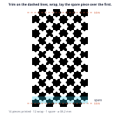
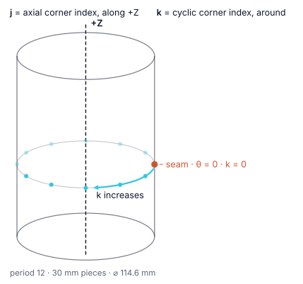

# How to print and wrap a PuzzlePole

A **PuzzlePole** is the [PuzzleBoard](puzzleboard.md) pattern wrapped around a
cylinder. Because the pattern closes, the target is recognisable from any
direction — which is the thing no planar target can do.

This page covers making one. It comes from Zach & Stelldinger,
[*PuzzlePoles: Cylindrical Fiducial Markers Based on the PuzzleBoard
Pattern*](https://arxiv.org/abs/2511.19448) (arXiv:2511.19448).

## 1. Pick a diameter — you do not get a free choice

The pattern only closes at a few circumferences, so a pole's diameter is
**quantised**. Pick the combination that lands nearest the tube you can
actually buy, then buy that tube — not the other way round.

Diameter in mm, for a circumference of `p` pieces at a given piece size:

| period `p` | 8 mm | 10 mm | 15 mm | 20 mm | 25 mm | 30 mm |
|---|---|---|---|---|---|---|
| **12** | 31 | 38 | 57 | 76 | 95 | 115 |
| **18** | 46 | 57 | 86 | 115 | 143 | 172 |
| **24** | 61 | 76 | 115 | 153 | 191 | 229 |
| **30** | 76 | 95 | 143 | 191 | 239 | 286 |
| **36** | 92 | 115 | 172 | 229 | 286 | 344 |
| **42** | 107 | 134 | 201 | 267 | 334 | 401 |
| **48** | 122 | 153 | 229 | 306 | 382 | 458 |

The rule is `diameter = p × piece / π`. Nothing else is supported: a
circumference that is not in this table does not close, and the library
refuses it rather than rounding to a neighbour.

**Bias towards a larger `p` when you can.** More pieces around the
circumference means more of the code is visible from one side, and a camera
sees at most about a third of the circumference before the pattern is too
foreshortened at the limb to read.

The second dimension — how tall the pole is — is free. It is
`axial_pieces × piece` from the lowest to the highest corner.

### What fits on one sheet

The strip is printed `p + 2` pieces tall, so the page bounds the piece size —
and that turns out to bound the *diameter* far more than the period does. The
largest pole each period gives on a single A4 portrait sheet at a 10 mm margin:

| period | largest piece | strip height | resulting ⌀ |
|---|---|---|---|
| 12 | 19 mm | 266 mm | **73 mm** |
| 18 | 13 mm | 260 mm | **75 mm** |
| 24 | 10 mm | 260 mm | **76 mm** |
| 30 | 8 mm | 256 mm | **76 mm** |
| 36 | 7 mm | 266 mm | **80 mm** |
| 42 | 6 mm | 264 mm | **80 mm** |
| 48 | 5 mm | 250 mm | **76 mm** |

So one A4 sheet is a roughly 75 mm pole whichever period you choose, and the
period is really a trade between **piece size** — how many pixels a code dot
gets, so how far away it still reads — and **how much of the circumference is
visible at once**. A bigger pole needs a bigger sheet, not a different period.

### If you already have the tube

The more common situation is the reverse: you have a tube and need a target
that fits it. `diameter = p × piece / π` rearranges, so

```rust
use calib_targets::puzzleboard::PuzzlePolePeriod;

// A 75 mm tube: what piece size does each circumference need?
for squares in [12, 18, 24, 30, 36, 42, 48] {
    let period = PuzzlePolePeriod::canonical(squares).expect("a supported circumference");
    println!("{squares:2} pieces -> {:.1} mm", period.piece_size_for_diameter(75.0));
}
// 12 -> 19.6   18 -> 13.1   24 -> 9.8   30 -> 7.9   36 -> 6.5   42 -> 5.6   48 -> 4.9
```

Every period wraps every diameter; what changes is how large a piece is, and
so how many pixels a code dot gets. Take the largest piece the tube and the
sheet both allow.

## 2. Generate the strip

```bash
calib-targets gen puzzlepole \
  --out-stem pole \
  --circumference-squares 18 \
  --axial-squares 8 \
  --square-size-mm 13 \
  --page-size a4
```

That writes `pole.json`, `pole.svg`, `pole.png` and `pole.dxf`. The SVG is what
you print; the JSON is the spec, which you can re-render or hand to another
tool.

From Rust:

```rust,no_run
use calib_targets::generate::puzzlepole_document;
use calib_targets::printable::write_target_bundle;

# fn main() -> Result<(), Box<dyn std::error::Error>> {
// 18 pieces around, 8 along, 13 mm pieces -> a 75 mm cylinder on A4.
let doc = puzzlepole_document(18, 8, 13.0)
    .expect("18 is a supported circumference");
write_target_bundle(&doc, "pole")?;
# Ok(())
# }
```

If the strip does not fit, the generator says so with both measurements:

```text
board does not fit page: board 120.000x390.000 mm, printable area 190.000x277.000 mm
```

Use a smaller piece size or a larger sheet — but do **not** scale it to fit.

## 3. Print at 100 %

Turn off *scale to fit*, *shrink oversized pages*, and *fit to printable area*.
This matters more here than for a flat board: the diameter is derived from the
piece size, so a print at 96 % is a pole of the wrong diameter, and every 3D
point the library reports for it will be wrong by that factor in a way nothing
downstream can detect.

Measure a piece with a ruler after printing. It should be the number you asked
for.

## 4. Trim and wrap



Two details, both of which matter:

**Trim through the middle of the first and last pieces**, not along a piece
boundary. A code dot sits *on* every joint between pieces, so cutting at a
boundary would slice a dot in half and lose a bit of the code. Cutting
mid-piece leaves every dot whole, and the two half-pieces recombine into one
when the ends meet.

**Lay the last piece over the first.** After trimming, the strip carries one
piece more material than the circumference. That spare piece is a duplicate of
the first, so laying it on top reproduces exactly what it covers and the
pattern stays continuous across the joint.

That the overlap is invisible is not a coincidence, and it is the whole reason
the construction needs the periods in the table above rather than any old
spacing: the strip repeats **two** consecutive rows of the master pattern, and
two is exactly what a one-piece overlap costs.

Glue the strip to a rigid tube of the diameter from step 1. A tube that is
slightly the wrong size shows up as a visible step at the joint — if the ends
do not meet cleanly, check the printed piece size before blaming the tube.

## 5. What the pole's coordinates mean



Every corner on a pole has two indices and two positions:

- **`j`, the axial index** — which corner row along the cylinder, counted from
  the end you designated the origin. It drives **+Z**.
- **`k`, the cyclic index** — which corner row around the circumference,
  counted from the seam. It drives the angle, `θ = 2πk / p`, increasing
  counter-clockwise seen from +Z.

The **seam** is `k = 0` and `θ = 0`: the joint you just glued. The frame is
right-handed with its origin on the axis at `j = 0`.

The unrolled *surface* position — where a corner sits on the flat strip, before
you wrapped it — is also reported, and it is the pole's analogue of a flat
board's target position.

## Related

- [Choose a target](howto_choose_target.md) — whether a pole is the right
  answer at all.
- [PuzzleBoard](puzzleboard.md) — the pattern a pole is cut from.
- [Printing targets](printable.md) — the general printing guidance.
